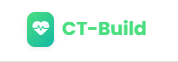
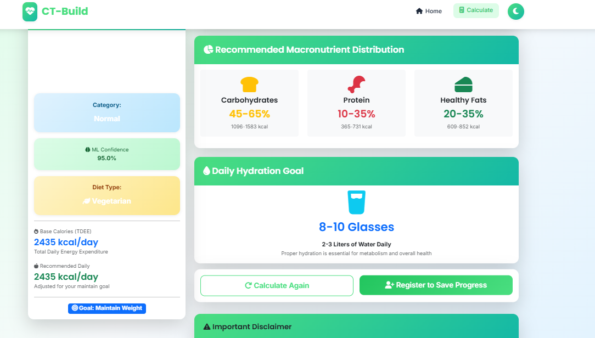

# CT-Build: AI-Powered Diet Recommendation System

  


## Overview

CT-Build is a full-stack web application built with **Django** and **machine learning** to provide personalized diet recommendations. Users input their age, gender, weight, height, activity level, dietary goals (e.g., weight loss, muscle gain), and preferences (e.g., vegetarian, vegan, non-vegetarian). The system calculates **BMI** (Body Mass Index) and **TDEE** (Total Daily Energy Expenditure) using pre-trained ML models, then generates tailored meal plans from a library of 12 predefined diet options categorized by BMI levels (underweight, normal, overweight, obese).

Key technologies:
- **Backend**: Django 4.2.7 with SQLite3 database
- **Frontend**: Bootstrap 5 for responsive UI
- **ML**: Scikit-learn (Random Forest Classifier for BMI, Random Forest Regressor for TDEE)
- **Data Sources**: Kaggle datasets for training (e.g., BMI and obesity data)

This project is ideal for health enthusiasts, nutritionists, or as a portfolio demo for full-stack ML apps.

## Features

- **User Authentication**: Secure login/register (placeholders implemented; extend with Django's built-in auth).
- **Personalized Calculations**: Real-time BMI and TDEE computation via loaded ML models.
- **Diet Recommendations**: Suggests calorie-controlled meal plans based on user profile and preferences.
- **Dashboard**: Track weight history and view past recommendations.
- **Admin Panel**: Django admin for managing users, recommendations, and logs.
- **Responsive Design**: Mobile-friendly templates with Bootstrap.

## Installation & Setup

### Prerequisites
- Python 3.8+ (tested with 3.12)
- Git

### Steps

1. **Clone the Repository**:
   ```
   git clone https://github.com/nickrajput716/ct-build.git
   cd ct-build
   ```

2. **Create Virtual Environment**:
   ```
   python -m venv venv
   source venv/bin/activate  # On Windows: venv\Scripts\activate
   ```

3. **Install Dependencies**:
   ```
   pip install -r requirements.txt
   ```
   *Dependencies include: Django==4.2.7, numpy, pandas, scikit-learn, pillow.*

4. **Train ML Models** (if not pre-trained):
   - Navigate to `ml_training/`:
     ```
     cd ml_training
     python train_models.py
     ```
   - This script loads datasets from `/datasets/`, trains Random Forest models, and saves `.pkl` files to `/ml_models/`.

5. **Apply Migrations**:
   ```
   python manage.py makemigrations
   python manage.py migrate
   ```

6. **Create Superuser** (for admin):
   ```
   python manage.py createsuperuser
   ```

7. **Run the Server**:
   ```
   python manage.py runserver
   ```
   - Access at `http://127.0.0.1:8000/`

### Database
- Uses SQLite3 by default (`db.sqlite3`). For production, switch to PostgreSQL in `settings.py`.

## Usage

1. **Register/Login**: Create an account on the login page.
2. **Calculate Diet**: Navigate to `/calculate/` and fill the form with your details.
3. **View Results**: Get BMI category, TDEE, and a sample 7-day meal plan on `/result/`.
4. **Track Progress**: Update weight logs via the dashboard.
5. **Admin**: `/admin/` for backend management.

Example Workflow:
- Input: Age=25, Weight=70kg, Height=170cm, Activity=Moderate, Goal=Weight Loss, Preference=Vegetarian.
- Output: BMI=24.2 (Normal), TDEE=2500kcal, Recommended Plan: "Balanced Veg Plan" with daily meals.

## Project Structure

```
ct-build/
├── datasets/              # Training data from Kaggle
│   ├── bmi.csv            # BMI dataset for classification
│   └── ObesityDataSet.csv # Obesity risk factors for TDEE regression
├── diet_app/              # Main Django app
│   ├── __init__.py
│   ├── admin.py           # Admin registrations for models
│   ├── apps.py
│   ├── migrations/        # Database migrations
│   ├── models.py          # UserProfile, Recommendation, WeightLog models
│   ├── tests.py
│   ├── urls.py            # App URLs (e.g., calculate, result)
│   └── views.py           # Core views (CalculateView, ResultView, DashboardView)
├── diet_project/          # Django project settings
│   ├── __init__.py
│   ├── asgi.py
│   ├── settings.py        # Config: DEBUG=True, INSTALLED_APPS, etc.
│   ├── urls.py            # Root URLs
│   └── wsgi.py
├── ml_models/             # Saved ML models
│   ├── bmi_classifier.pkl # Random Forest for BMI category
│   └── tdee_regressor.pkl # Random Forest for TDEE prediction
├── ml_training/           # ML training scripts
│   └── train_models.py    # Trains and saves models using datasets
├── staticfiles/           # Collected static files (admin CSS/JS)
│   └── admin/
├── templates/             # HTML templates (Bootstrap-based)
│   ├── base.html          # Base template with navbar, messages
│   ├── calculate.html     # Input form for user data
│   ├── result.html        # Results display with charts/tables
│   ├── dashboard.html     # User dashboard
│   ├── login.html         # Auth pages (placeholders)
│   └── register.html
├── db.sqlite3             # SQLite database
├── manage.py              # Django management script
├── requirements.txt       # Project dependencies
└── README.md              # This file!
```

### Key Code Highlights

- **Models (`diet_app/models.py`)**: Define UserProfile (extends Django User), Recommendation (stores plans), WeightLog (tracks progress).
- **Views (`diet_app/views.py`)**: 
  - `CalculateView`: Handles form submission, loads ML models, computes BMI/TDEE.
  - `ResultView`: Renders personalized plan.
  - Integrates `joblib.load` for model prediction.
- **Training Script (`ml_training/train_models.py`)**: 
  - Loads CSV data with Pandas.
  - Preprocesses (e.g., BMI calc: weight / (height_m ** 2)).
  - Fits RandomForestClassifier/Regressor.
  - Saves with `joblib.dump`.
- **Templates**: Extend `base.html`; use Django forms and crispy-forms for styling.

## Screenshots

Add your own screenshots by placing images in a `/screenshots/` folder and committing them. Here's how to embed them:

### Home/Landing Page
  
*(Shows navbar and welcome message)*

### Calculate Diet Form
  
*(User input fields for age, weight, etc.)*

### Results Page
  
*(BMI chart, TDEE value, meal plan table)*

### Dashboard
  
*(Weight history graph and recent recommendations)*


## Contributing

1. Fork the repo.
2. Create a feature branch (`git checkout -b feature/amazing-feature`).
3. Commit changes (`git commit -m 'Add amazing feature'`).
4. Push to branch (`git push origin feature/amazing-feature`).
5. Open a Pull Request.

## Future Enhancements

- Integrate email notifications for weekly plans.
- Add image upload for food logging (using Pillow).
- Deploy to Heroku/Vercel with PostgreSQL.
- Advanced ML: Use TensorFlow for recipe generation.
- API endpoints for mobile app integration.

## License

MIT License - feel free to use and modify!

## Contact

- GitHub: [nickrajput716](https://github.com/nickrajput716)
- Questions? Open an issue on the repo.

---

*Built with ❤️ for healthier living. Last updated: November 24, 2025*
